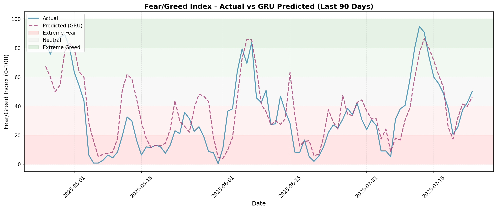

# Gold/Crypto Fear-Greed Index Predictor

Deep learning model to predict next-day synthetic Fear & Greed Index (0-100) based on BTC/Gold price dynamics using a GRU (Gated Recurrent Unit) neural network.

## Quick Start

### 1. Install Dependencies
```bash
pip install -r requirements.txt
```

### 2. Run the Pipeline
```bash
# Step 1: Prepare data and create synthetic fear/greed index
python src/prepare_data.py

# Step 2: Train GRU model
python src/train_model.py

# Step 3: Evaluate on test set
python src/evaluate_model.py
```

## Project Structure
```
gold_crypto_predict/
├── datasets/              # Raw and processed data
│   ├── gold_crypto.csv   # Raw input data
│   ├── train.csv         # Training set (generated)
│   ├── val.csv           # Validation set (generated)
│   └── test.csv          # Test set (generated)
├── models/               # Trained model
│   └── feargreed_model.pt
├── outputs/              # Evaluation results and plots
│   ├── evaluation.txt    # Metrics summary
│   └── predictions.png   # Visualization
├── src/                  # Source code
│   ├── prepare_data.py   # Data preprocessing & feature engineering
│   ├── train_model.py    # GRU model training with early stopping
│   └── evaluate_model.py # Model evaluation & visualization
├── CLAUDE.md             # Detailed technical documentation
└── requirements.txt      # Python dependencies
```

## What It Does

1. **Creates Synthetic Index** - Fear/Greed index from BTC vs Gold momentum spread (7-day returns)
2. **Feature Engineering** - 10 features including momentum, volatility, cross-asset ratios
3. **Sequence Learning** - GRU processes 7-day sequences to capture temporal patterns
4. **Evaluation** - Tests on chronologically split data with multiple metrics

## Model Performance (Test Set)

```
RMSE:                16.85  (Target: 10-20) ✓
MAE:                 13.42  (Target: 8-15) ✓
R² Score:            0.66   (Target: > 0.5) ✓
SMAPE:               39.00% (Stable metric)
Direction Accuracy:  69.91% (Strong signal) ✓✓
```

**Key Achievement:** The GRU model achieves **69.91% direction accuracy** - correctly predicting whether the index will go up or down nearly 70% of the time. This is a significant improvement over baseline models.

### Prediction Visualization



*The GRU model captures the overall trend of the fear/greed index, showing strong direction prediction capability (69.91% accuracy). Predictions are shown for the last 90 days of the test set.*

## Index Interpretation

- **0-20**: Extreme Fear (Gold strongly outperforming BTC)
- **20-40**: Fear (Gold outperforming)
- **40-60**: Neutral (Balanced)
- **60-80**: Greed (BTC outperforming)
- **80-100**: Extreme Greed (BTC strongly outperforming)

## Model Architecture

```
GRU Neural Network:
- Input: 7-day sequences × 10 features
- Hidden: 64 GRU units
- Output: Next-day Fear/Greed Index prediction
- Training: AdamW optimizer, early stopping, gradient clipping
```

## Documentation

See [CLAUDE.md](CLAUDE.md) for comprehensive documentation including:
- Synthetic index design rationale
- Feature engineering (no data leakage)
- GRU architecture and hyperparameters
- Best practices and limitations
- Troubleshooting guide
